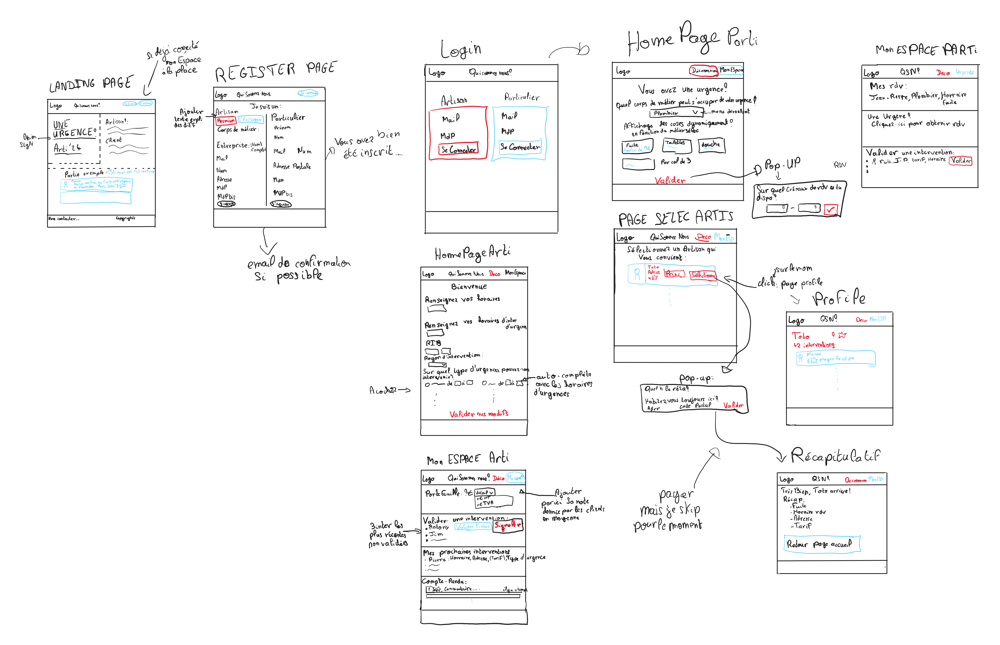
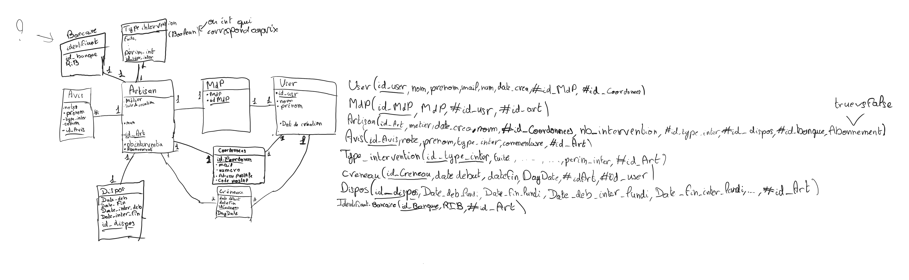

# Arti24

Ce site web a pour but de mettre en relation les artisans et les particuliers en cas d'ugence (Cas de pannes, fuites, etc...)
Personnellement, c'était l'occasion pour moi de prendre en main le langage de programmation back-end PHP ainsi que le langage de requête SQL.

## Requirements
Pour faire tourner ce projet en local, j'ai utilisé une Base de donnée MySQL ainsi qu'un serveur Web (Apache).

Voici la description des différentes sections de ce projet:

## Overview
Pour comprendre le fonctionnement du projet, j'ai établit deux schémas qui sont ma ligne directrice de ce projet. Ils sont disponibles dans la section Annexe mais vous pourrez les retrouver ci-dessous.

### Schéma de l'infrastructure 
Dans ce document, vous retrouverez l'ensemble des pages du site Web qui doivent être affichées. En l'état, elles existent toutes mais il n'y a aucune fiche de style, on retrouve donc uniquement la structure.

### Schéma de la BDD
De la même manière pour la base de donnée, le document suivant explique grossièrement la structure de la base de donnée. Il se peut que certains changements aient été effectué en pratique sur la base de donnée mais que le schéma n'ait pas été corrigé. La création de toutes les tables de la BDD se situe dans le fichier [scriptSQL](ScriptSQL/createTable2.sql).

Ce schéma suit le principe de l'UML, de manière grossière.

## Home
La page d'accueil explique le fonctionnement du site Web et des besoins qu'il résout. On y retrouve par exemple des avis de particuliers satisfait. Il permet aussi la connexion et/ou l'inscription au site.

## Connexion
Ce répertoire contient les pages concernant l'affichage des formulaires de connexion et d'inscription des artisans et particuliers. 

 + Le fichier **config.php** s'occupe de la connexion à la base de donnée (oui les identifiants sont en clair mais pas de chance pour vous la base tourne en local hehe)
 + Le fichier **connexion.php** traite la demande de connexion, et connecte l'utilisateur si le mot de passe et le nom d'utilisateur correspondent à une entrée de la BDD
 + Le fichier **function.php** contient une floppée de fonctions qui permettent l'affichage et la vérification de différente donnée insérée par l'utilisateur.
 + Le fichier **inscription.php** insère les données relatives à l'inscription d'un utilisateur dans la BDD. C'est un point sensible niveau sécurité.
 + Le fichier **login.php** affiche la page de connexion pour les artisans et particuliers. Une fois n'est pas coutume, les logins sont en clair en commentaire du document pour simplifier la phase de test. 
 + Le fichier **register.php** affiche la page d'inscription des artisans et particuliers.

## Espace Artisan
Ce répertoire contient les pages une fois qu'un artisan se connecte au site web.

 + Le fichier **artisan.php** s'occupe du traitement des données lorsque l'artisan modifie son profil
 + Le fichier **homepageArtisan.php** est la page d'accueil de l'artisan. Il peut ici modifier toutes les données qu'il a inséré à l'inscription (horraire de travail, type d'intervention à effectuer, périmètre d'intervention, RIB...)
 + Le fichier **monEspaceArtisan.php** contient l'ensemble des données les plus importantes pour un artisan (sa note globale, les prochaines interventions prévues, les avis des précédents clients...)
 + Le fichier **profilArtisan.php** est une page n'est pas encore construite, mais qui devait permettre aux particuliers de consulter le profil des artisans

## Espace Particulier
Ce répertoire contient les pages une fois qu'un particulier se connecte au site web.

 + Le fichier **function.js** est un script utilisé dans la page d'accueil pour simplifier la visualisation des informations importantes (permet la création d'un pop up).
 + Le fichier **homepageParticulier.php** est la page d'accueil, c'est ici qu'un particulier peut spécifier les informations recherchées par le particulier pour l'intervention d'un Artisan.
 + Le fichier **monEspaceParticulier.php** permet de visualier les futures interventions à venir avec les Artisans.
 + Le fichier **recapIntervention.php** n'a pas encore été créé, mais comme son nom l'indique ce sera une page récapitulive de l'intervention qui sera effectué.
 + Le fichier **selecArtisan.php** affiche les artisans compatibles avec les critères recherchés, puis permet au particulier de choisir son artisan favori. 

## Traitement
Ce répertoire contient deux fichiers qui ont pour but de traiter les données lorsqu'un particulier fait une recherche d'artisan pour une intervention. En gros, cela permet de selectionner les artisans qui correspondent au critères du particulier dans la base de donnée

## Suite du projet
Ce projet est toujours en cours de construction et n'est pas du terminé. La majeure partie du travail à faire reste la partie front, car aucun style n'a été intégré à ce jour.
